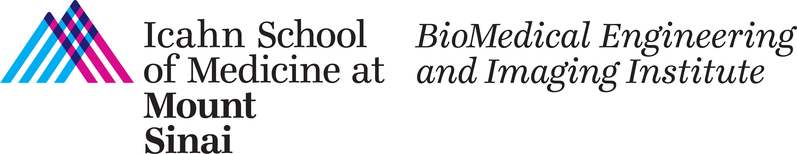

# Unified Supervision for Vision-Language modeling in 3D computed tomography 
**Official Code Release for ICCV 2025 3DVLM Workshop Paper**
> **Title**: *Unified Supervision for Vision-Language modeling in 3D computed tomography*  
> **Conference**: ICCV 2025, Vision-Language Modeling in 3D Medical Imaging (VLM3D) Workshop
<p align="left">
  
</p>

---
## Overview
Uniferum is a volumetric vision-language model designed for radiology. Uniferum integrates classification labels and segmentation masks into a single unified training framework.

- Harmonizes classification and segmentation across multiple CT datasets.
- Improves State-of-the-Art Results on the CT-RATE benchmark by +7% compared to CLIP-based models.
- Robust out-of-distribution performance
- zero-shot capabilities on RAD-CHEST and INSPECT datasets.

---
## Citation

If you find this code useful for your research, please consider citing our work:

```bibtex
@inproceedings{iccv2025uniferum,
  title={Unified Supervision for Vision-Language modeling in 3D computed tomography},
  author={Hao-Chih Lee, Zelong Liu, Hamza Ahmed, Spencer Kim, Sean Huver,
Vishwesh Nath, Zahi A. Fayad, Timothy Deyer, Xueyan Mei},
  booktitle={ICCV VLM3D Workshop},
  year={2025}
}
```
<p align="left">
  
</p>
